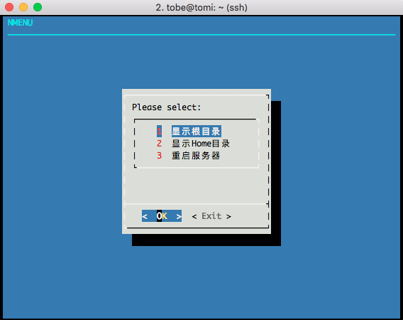

# Nmenu

<div style="text-align:center"></div>

## Introduction

`nmenu` is the toolkit to run any customized shell command with ncurses menu.

- [x] Support for mice and pointers
- [x] Support for keyboard shortcuts
- [x] Support for multiple languages

## Usage

```
wget https://raw.githubusercontent.com/tobegit3hub/nmenu/master/nmenu -o /usr/bin/nmenu

chmod +x /usr/bin/nmenu

nmenu
```

## Customization

You can add commands or change the titles in `nmenu` script.

```
titles=(
  "显示根目录"
  "显示Home目录"
  "重启服务器"
)
commands=(
  "ls /"
  "ls ~"
  "sudo reboot"
)
```

If you have more than three commands, make sure to add parameters in `dialog`.

```
selection=$(dialog \
  --backtitle $MENU_TITLE \
  --clear \
  --cancel-label "Exit" \
  --menu "Please select:" $HEIGHT $WIDTH 0 \
  "1" "${titles[0]}" \
  "2" "${titles[1]}" \
  "3" "${titles[2]}" \
  2>&1 1>&3)
```
